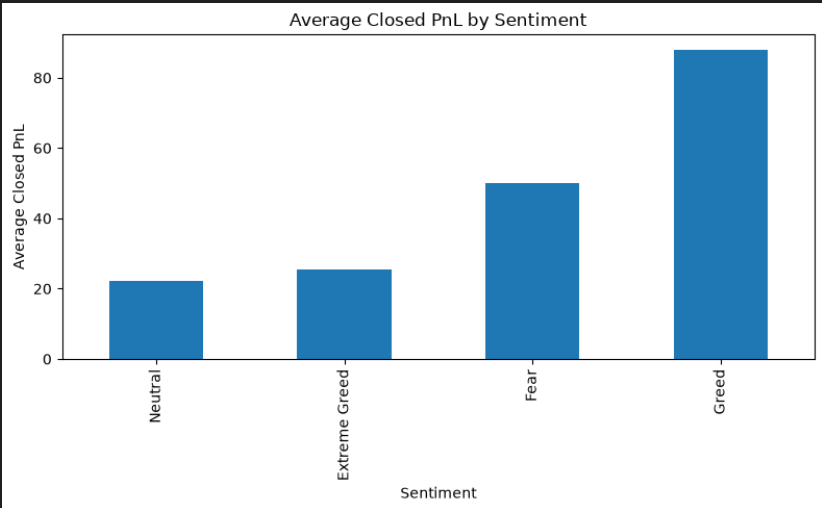

# Hyperliquid Trader Performance Analysis using Bitcoin Market Sentiment

## Overview

This project explores the relationship between **Bitcoin market sentiment** and **trader performance on Hyperliquid** by integrating historical trading records with the **Bitcoin Fear & Greed Index**.

The analysis follows a complete data analytics workflow—from data preprocessing and integration to exploratory analysis, statistical evaluation, and business recommendations—to identify patterns that can support more informed trading strategies.

---

## Problem Statement

Financial markets are strongly influenced by investor psychology. The Bitcoin Fear & Greed Index provides a daily measure of overall market sentiment, while Hyperliquid trading records capture detailed information about executed trades and realized profits.

The objective of this project is to investigate whether trader behavior and profitability vary across different market sentiment conditions.

The analysis aims to answer the following questions:

- How is trading activity distributed across different market sentiment conditions?
- Does trader profitability change during Fear, Neutral, and Greed markets?
- Which cryptocurrencies contribute most to trading activity?
- How do different trading directions perform?
- What business insights can be derived to support smarter trading strategies?

---

## Project Objectives

- Load and preprocess multiple datasets.
- Clean and standardize trading records.
- Merge trading data with the Bitcoin Fear & Greed Index.
- Perform exploratory data analysis (EDA).
- Compare trader performance across sentiment categories.
- Generate statistical summaries and business insights.
- Provide actionable recommendations based on the findings.

---

## Dataset Description

### 1. Hyperliquid Historical Trading Dataset

Contains historical trading activity from Hyperliquid.

Key attributes include:

- Account
- Coin
- Execution Price
- Trade Size (USD)
- Trading Direction
- Closed Profit & Loss (PnL)
- Trading Fee
- Timestamp

---

### 2. Bitcoin Fear & Greed Index

Contains daily Bitcoin market sentiment.

Attributes include:

- Date
- Sentiment Score
- Market Sentiment Classification
  - Extreme Fear
  - Fear
  - Neutral
  - Greed
  - Extreme Greed

---

## Project Workflow

```
Load Datasets
      │
      ▼
Data Cleaning & Preprocessing
      │
      ▼
Dataset Integration
      │
      ▼
Exploratory Data Analysis
      │
      ▼
Statistical Analysis
      │
      ▼
Business Insights
      │
      ▼
Recommendations
```

---

## Project Structure

```
hyperliquid-trader-sentiment-analysis/

│
├── data/
│   ├── raw/
│   └── processed/
│
├── images/
│   ├── market_sentiment_distribution.png
│   └── trader_performance_by_sentiment.png
│
├── notebooks/
│   └── 01_sentiment_analysis.ipynb
│
├── src/
│   ├── analysis.py
│   ├── config.py
│   ├── data_loader.py
│   ├── eda.py
│   ├── merge_data.py
│   └── preprocessing.py
│
├── README.md
├── requirements.txt
├── main.py
└── .gitignore
```

---

## Installation

Clone the repository

```bash
git clone https://github.com/prerna-m01/hyperliquid-trader-sentiment-analysis.git
```

Navigate into the project

```bash
cd hyperliquid-trader-sentiment-analysis
```

Create a virtual environment

```bash
python -m venv .venv
```

Activate the environment

### Windows

```bash
.venv\Scripts\activate
```

### Linux / macOS

```bash
source .venv/bin/activate
```

Install the required packages

```bash
pip install -r requirements.txt
```

---

## Running the Project

Run the data loading script

```bash
python main.py
```

For the complete analysis, open the notebook:

```
notebooks/01_sentiment_analysis.ipynb
```

Run all cells sequentially.

---

# Sample Visualizations

The following visualizations summarize some of the key findings from the analysis.

---

## 1. Market Sentiment Distribution

This visualization illustrates the number of trades executed under different Bitcoin market sentiment categories after merging the trading dataset with the Fear & Greed Index.

<p align="center">
  
</p>

### Observation

- Most trading activity occurred during **Fear** market conditions.
- **Greed** represents the second-largest share of trading activity.
- **Neutral** and **Extreme Greed** account for relatively fewer trades.
- The dataset indicates that trading activity is concentrated during periods of market fear.

---

## 2. Trader Performance by Market Sentiment

This visualization compares the average realized profit (**Closed PnL**) across different Bitcoin market sentiment categories.

<p align="center">
  
</p>

### Observation

- Average trader profitability varies across different market sentiment categories.
- In this dataset, trades executed during **Greed** conditions show the highest average realized profit.
- **Fear** also exhibits higher average profitability than **Neutral** and **Extreme Greed**.
- The visualization demonstrates an association between market sentiment and trader performance; however, it should not be interpreted as evidence of causation.

---

## Methodology

The project was completed in five phases:

### Phase 1 — Data Loading

- Loaded both datasets successfully.
- Verified dataset structure and column names.

### Phase 2 — Data Cleaning & Preprocessing

- Standardized column names.
- Converted timestamps into datetime format.
- Created a common date column.
- Converted numerical columns.
- Removed duplicate records.
- Performed data quality checks.

### Phase 3 — Dataset Integration

- Merged trading data with the Fear & Greed Index using the trading date.
- Validated the merge.
- Removed records without matching sentiment values for analysis.

### Phase 4 — Exploratory Data Analysis

Performed exploratory analysis on:

- Market sentiment distribution
- Trader profitability
- Trading direction
- Most traded cryptocurrencies
- Trade size distribution
- Trading fee distribution

### Phase 5 — Statistical Analysis

Computed:

- Average Closed PnL
- Median Closed PnL
- Total Closed PnL
- Win Rate
- Performance by trading direction
- Coin-wise profitability
- Top-performing trader accounts

---

## Key Findings

The analysis revealed several important insights:

- Trading activity is primarily concentrated during **Fear** market conditions.
- **HYPE** is the most actively traded cryptocurrency in the dataset.
- Long-position trades occur more frequently than short-position trades.
- Average realized profit differs across market sentiment categories, with **Greed** showing the highest average Closed PnL.
- Trade sizes and transaction fees exhibit highly right-skewed distributions, indicating that a relatively small number of large trades contribute significantly to overall trading volume.
- Trader profitability is unevenly distributed, with a small number of accounts generating a substantial share of total realized profits.

---

## Business Recommendations

Based on the analysis, the following recommendations may support improved trading decisions:

- Use the Bitcoin Fear & Greed Index as a complementary indicator alongside technical analysis.
- Monitor trading behavior during **Fear** and **Greed** periods, as trader performance varies across sentiment conditions.
- Investigate consistently profitable trader accounts to identify successful trading patterns.
- Focus further analysis on highly traded assets such as **HYPE** and **BTC**.
- Incorporate additional market indicators, including Bitcoin price, volatility, and trading volume, to develop more comprehensive trading models.

---

## Technologies Used

- Python
- Pandas
- NumPy
- Matplotlib
- Jupyter Notebook

---

## Future Improvements

Potential extensions of this project include:

- Integration of live Bitcoin market data.
- Time-series analysis of trader behavior.
- Machine learning models for profit prediction.
- Interactive dashboards using Streamlit or Power BI.
- Real-time market sentiment monitoring.

---

## Author

**Your Name**

GitHub: https://github.com/prerna-m01

LinkedIn: www.linkedin.com/in/prernamishra01

---